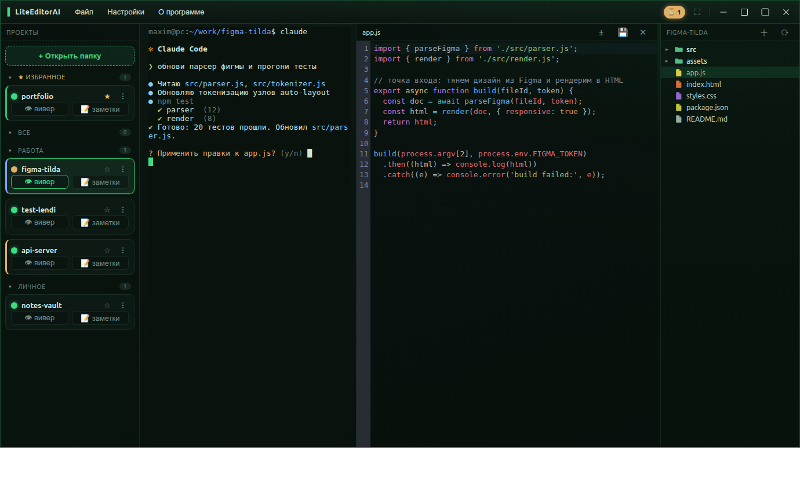
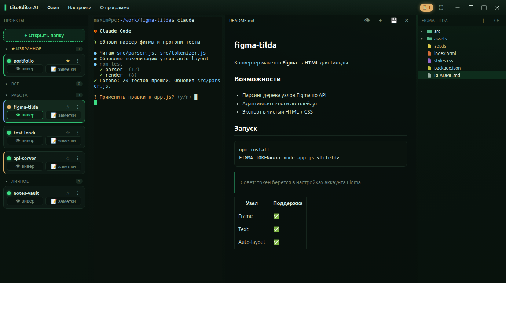
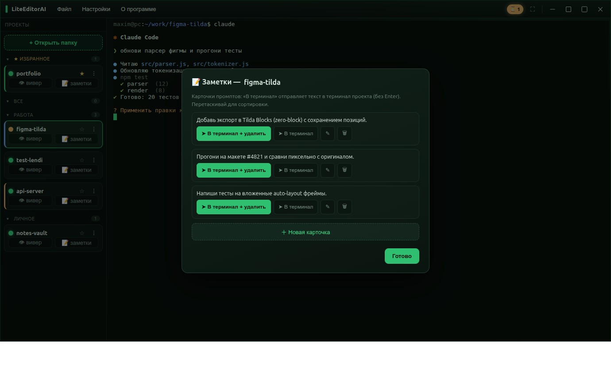

<div align="center">

# ▍ LiteEditorAI

**Лёгкий редактор для работы с ИИ-агентами прямо в терминале.**

[](LICENSE)
[](https://github.com/DanielLetto2020/LiteEditorAI/releases)
[](#установка)
[](https://www.electronjs.org/)
[](#статус)

</div>


## Проблема

Редакторы кода годами росли вширь: они затачивались под то, чтобы человек **писал проект руками** —
отсюда сотни панелей, плагинов и настроек, тяжёлый запуск и перегруженный интерфейс.

Но формат работы изменился. Всё чаще код пишут **ИИ-агенты прямо в терминале** (Claude Code, Codex,
Qwen, Kimi…), а ты ведёшь **сразу несколько проектов параллельно**. Для этого тяжёлый IDE избыточен,
а голый терминал неудобен: не видно, какой агент уже закончил, какой ждёт твоего ответа, что он наменял
в файлах и где вообще какой проект.

**LiteEditorAI** — лёгкая альтернатива под этот новый формат. Главное — терминал на каждый проект,
а от редактора ровно столько, сколько нужно, чтобы следить за агентом. И ничего лишнего.

## Что умеет

- 🖥 **Терминал на каждый проект.** Переключаешься между агентами как между вкладками; у каждого свой живой shell.
- 🚦 **Видно состояние агента:** работает (спиннер) · ждёт твоего ответа (янтарный) · готов (зелёный).
  Плюс системные уведомления и счётчик «сколько агентов ждут» — не нужно щёлкать каждый, чтобы понять, кто освободился.
- 👁 **Просмотр и правка кода рядом:** дерево файлов, подсветка, сохранение, поиск, дифф изменений,
  превью Markdown / картинок / HTML. Дерево само обновляется, пока агент правит файлы.
- 📝 **Заметки-промпты на проект:** копишь следующие промпты карточками и отправляешь в терминал в один клик.
- ⎇ **Git под рукой:** статус в дереве, ветки, commit / push / pull / fetch, откат файла — без выхода из окна.
- 🗂 **Порядок в проектах:** категории, избранное, акцент-цвета, авто-скан папки с проектами.
- ⌨️ **Быстро:** палитра команд `Ctrl+K`, переключение проектов `Ctrl+1..9`, drag-and-drop папки, темы.
- 🪶 **Без перегруза:** ничего не настраивать на старте, маленькая панель настроек, тёмный минималистичный UI.

## Скриншоты

**Вивер: код, дерево и git рядом с терминалом**



**Превью Markdown, HTML-страниц и картинок**



**Заметки-промпты на проект**



## Установка

Готовые сборки — на странице [**Releases**](https://github.com/DanielLetto2020/LiteEditorAI/releases).

### Ubuntu (x64)
```bash
sudo apt install ./LiteEditorAI_*.deb
```
Одна команда — поставит приложение и подтянет зависимости. Запуск — иконка **LiteEditorAI** в меню приложений.

### Windows (x64)
Скачай **portable**-архив `LiteEditorAI_*-win.zip`, распакуй в любую папку и запусти **`LiteEditorAI.exe`**.
Установка не нужна. Приложение пока без цифровой подписи — SmartScreen может предупредить:
«Подробнее» → «Выполнить в любом случае».

## Сборка из исходников

```bash
npm install        # зависимости + сборка node-pty под Electron
npm start          # сборка фронта + запуск
```

Требуется Node.js 18+ (Linux/Windows x64). Для разработчиков — [CONTRIBUTING.md](CONTRIBUTING.md).

## Горячие клавиши

| Клавиши | Действие |
|---|---|
| `Ctrl+\` | режим «один терминал» |
| `Ctrl+K` | палитра команд |
| `Ctrl+F` | поиск (в терминале или в открытом файле) |
| `Ctrl+S` | сохранить файл |
| `Ctrl+1..9` / `Ctrl+Tab` | переключение проектов |
| `Ctrl + +/−` | размер шрифта |
| `F11` | полный экран |

## Статус

**Alpha** — активно дорабатывается. Один терминал на проект; терминалы не переживают перезапуск.
Баги и идеи — в [Issues](https://github.com/DanielLetto2020/LiteEditorAI/issues).

## Лицензия

[Apache License 2.0](LICENSE) © 2026 Максим Кузьминский. При использовании и в производных работах
сохраняйте указание автора (см. [NOTICE](NOTICE)).

Сделано на [Electron](https://www.electronjs.org/), [xterm.js](https://xtermjs.org/),
[node-pty](https://github.com/microsoft/node-pty) и [CodeMirror 6](https://codemirror.net/).
