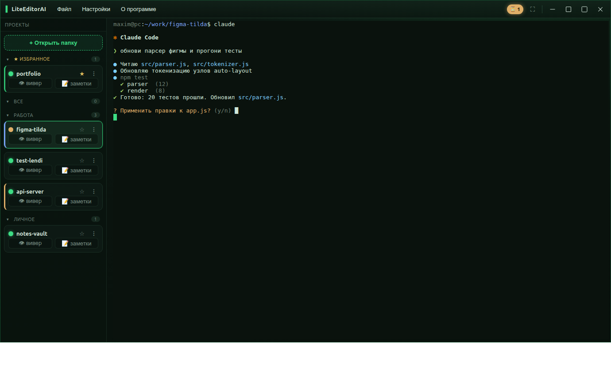
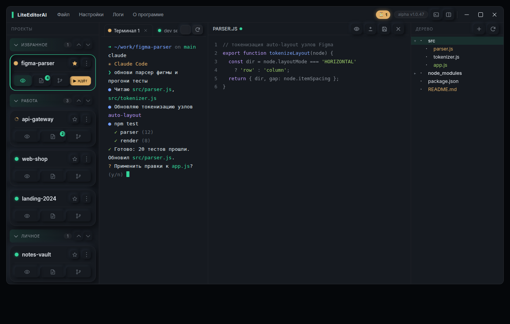
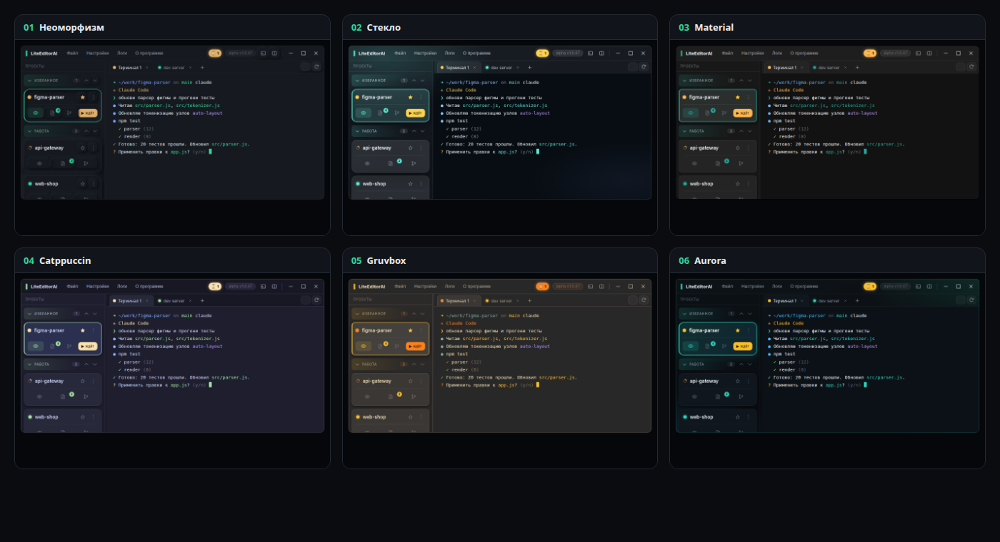

<div align="center">

# ▍ LiteEditorAI

**Редактор для эпохи, когда код пишет агент, а ты направляешь.**

[](LICENSE)
[](https://github.com/DanielLetto2020/LiteEditorAI/releases)
[](https://lite-editor-ai.ru)
[](#установка)
[](https://www.electronjs.org/)
[](#статус)

**🌐 Сайт проекта: [lite-editor-ai.ru](https://lite-editor-ai.ru)**

</div>



## Зачем

Когда код всё чаще пишет агент (Claude Code, Codex, Qwen, Kimi…), а не ты сам, привычный редактор
встаёт с ног на голову: в центре уже не файл, а **разговор с агентом в терминале**. Тяжёлый IDE с
сотней панелей под это избыточен, а голый терминал неудобен — не видно, какой агент уже закончил, какой
ждёт твоего ответа, что он наменял в файлах и где вообще какой проект.

**LiteEditorAI** построен вокруг этого: главный здесь твой терминал, а просмотр кода, дерево и git живут
рядом ровно настолько, насколько нужно следить за агентом, — и прячутся одной кнопкой, когда не нужны.
Это нарочно лёгкий и тихий инструмент: открыл папку — и сразу за дело, без долгой настройки.

## Что умеет

| Возможность | Коротко |
|---|---|
| 🛰 **Удалённый пульт (Android)** | Управление редактором с планшета или телефона через self-hosted релей: живой **цветной** экран терминала с ПК, своя экранная клавиатура, переключение проектов, **задачи проекта** (создание, статусы, отправка в терминал), просмотр и скачивание файлов ПК, безопасный перезапуск. Заточен под мобильный интернет. [Подробнее →](#удалённый-пульт-android) |
| 🖥 **Терминалы-вкладки на проект** | У каждого проекта свои живые shell-вкладки: агент в одной, dev-сервер в другой, разовая команда в третьей. Имена вкладок переживают перезапуск. |
| 💬 **Заготовленные промпты** | Частые реплики агенту — по правому клику в терминале: всплывающий список карточек, клик вставляет текст **без запуска**. Делятся на **проектные и общие**; менеджер добавляет, правит, переносит между списками. |
| 🚦 **Состояние агента с одного взгляда** | Работает (спиннер) · ждёт ответа (янтарный) · готов (зелёный), плюс уведомления и счётчик «сколько агентов ждут». Индикатор на карточке — агрегат по всем вкладкам проекта. |
| 💬 **Чат с моделями (OpenRouter)** | Свой ключ → рядом с проектами плашка-чат: любая модель с ценой и размером контекста, ответы **стримом** с подсветкой кода и Markdown, несколько сессий на ключ, картинки, баланс ключа. Ключи — локально. |
| ✍️ **Обработка текста локальным агентом** | Рабочий стол редактора: документ слева, **чат с агентом справа** — выделите фрагмент и попросите переписать, его обработает **локальный агент без API-ключей** (Claude Code / Codex), ответ заменит выделенное. Плюс **история правок с откатом**, **формулы (MathJax)**, нумерация по абзацам, закладки и панель форматирования. |
| ⚡ **Квикбар** | Полоса кнопок-иконок под терминалом: вынесите нужные модули в один клик, ставьте **разделители**, настраивайте состав и порядок — всё сохраняется. |
| 🗂 **Порядок в проектах** | Категории (создать / переименовать / свернуть, плюс «Архив»), избранное, акцент-цвета, авто-скан папки с проектами. |
| 🎨 **6 тем оформления** | Неоморфизм (по умолчанию), Стекло, Material, Catppuccin, Gruvbox, Aurora. Терминал перекрашивается под тему. |
| 🔔 **Уведомление об обновлениях** | Редактор сам сверяется с последним релизом и подсвечивает плашку у номера версии (само ничего не ставит). |
| 🪶 **Без перегруза, кросс-платформенно** | Ничего не настраивать на старте, маленькая панель настроек; Ctrl+C / Ctrl+V в терминале работают в любой раскладке на Linux и Windows. |

## Модули

**Модуль** — **отдельное окно** рядом с редактором. Открывается из меню **«Модули»**, палитры `Ctrl+K` или
квикбара. Можно держать открытыми **сразу несколько** окон (например, Git и базы данных рядом); каждое
запоминает свой размер и положение, а набор открытых окон **восстанавливается при следующем запуске**.
Окна, привязанные к проекту (код, Git, контекст, задачи, аудит), **следуют за активным проектом** редактора.
Меню «Модули» сгруппировано в раскрывающиеся подменю **«Встроенные»** и **«Мои модули»**.

| Модуль | Что делает |
|---|---|
| 👁 **Код** (вивер) | Дерево файлов, подсветка, правка и сохранение, поиск, **миникарта**, дифф изменений vs HEAD, превью Markdown / картинок / HTML. Дерево само обновляется, пока агент правит файлы. |
| ⎇ **Git** | В стиле JetBrains, три вкладки **Изменения / История / Ветки**. Изменения — двухпанельно: список файлов (группировка по статусу, карточки-сводки) и **превью диффа** рядом; **выборочный коммит** чекбоксами, commit / push / pull / fetch, **stash и возврат**, откат файла или всех правок. Merge и **разрешение конфликтов** в окне на три панели, **поиск по истории** коммитов. Статус — прямо в дереве файлов. |
| 🧠 **Контекст** | Сборка **CLAUDE.md / AGENTS.md как графа** (в духе n8n): текстовые блоки и группы-профили по тумблеру → выход агента, счётчики ≈токенов. **Claude и Codex — независимо**: у каждого свои профили и **история версий файла** («точки восстановления»). Существующий CLAUDE.md / AGENTS.md можно **распилить на блоки локальным агентом**; перед перезаписью — бекап. |
| ✅ **Задачи** | TODO со **статусами** (к выполнению · в работе · готово) и **важностью**, две вкладки **«проект» / «общие»**, отправка задачи в терминал, перенос между списками, **экспорт/импорт в JSON** (проект, общие или всё сразу). |
| 🔍 **Аудит** | Быстрый рентген проекта: типы файлов, **крупнейшие** по строкам/весу с флагом **аномалий**, медиа по весу, **гигиена** (мусор в гите, дубликаты, минифицированные, осиротевшие), **техдолг** (TODO/FIXME и потенциальные секреты — клик ведёт в файл на строке), **история** (горячие файлы по git-churn, свежие/забытые). Источник — git-tracked или весь каталог; сводка-паспорт в буфер и **экспорт отчёта**. |
| 🌐 **WEB/SEO аудит** | Самостоятельный анализатор сайтов (локальный dev-сервер **или** внешний домен): свой список сайтов и **история аудитов** с дельтой. Заголовки безопасности с оценкой, **TLS-сертификат**, экспонированные `.git/.env`, SEO-мета из **отрендеренной** страницы (скрытый Chromium), **Core Web Vitals** и вес страницы, скриншоты, техстек, **битые ссылки**, robots/sitemap, DNS · SPF/DMARC · WHOIS · гео. Сводка в буфер и **экспорт отчёта**; результаты приходят поэтапно. |
| 📋 **IterFlow** | Таск-трекер [IterFlow](https://iter-flow.ru) прямо в редакторе — теперь не только просмотр, но и **работа с задачами**: создание и правка итераций и задач, дедлайны, смена статуса на **Канбане**, переходы стадий итерации (сдать / согласовать / принять), заметки проекта. Вход → профиль → заказчик → проект, дальше вкладки **Итерация** (таймлайн), **Канбан**, **Туду** и **Чат**. Берите задачи в работу с ИИ-агентом, не уходя в браузер — удобно фрилансерам и студиям, которые согласуют работу с заказчиком. |
| 🐳 **Контейнеры** | Docker и Podman в одной панели (замена десктопным GUI): контейнеры по compose-проектам, поды, образы, тома, занятый диск; старт / стоп / перезапуск / удаление поштучно и **группой**; **живое автообновление статусов**, **живые логи** и **exec-терминал внутрь контейнера**. |
| 🗄 **Базы данных** | Лёгкий клиент Postgres / MySQL · MariaDB / SQLite: подключения по хосту или **через SSH-туннель**, дерево схемы, данные таблиц с пагинацией, **SQL-консоль** (`Ctrl+Enter`), экспорт CSV / JSON / SQL, режим **«только чтение»**. Пароли — в системном хранилище ключей; драйверы встроены. |
| 🔌 **Удалённые хосты** | Профили **SSH / SFTP / FTP** по категориям, вход в один клик и несколько живых сессий как **вкладки** (по паролю или **ключу из системы**, keepalive), **просмотр файлов** SFTP/FTP. Пароли не покидают бэкенд. |
| 🖳 **Системный терминал** | Отдельные шеллы вне проектов (домашняя папка), несколько вкладок — для разовых системных команд рядом с рабочим терминалом. |
| 🔧 **Инструменты** | Девтулз-комбайн, всё считается локально (без сети): **Base64 ↔ картинка** (drag&drop файла → data-URI/base64 с превью и размерами, и обратно), **JSON-вьюер** (дерево со сворачиванием и подсветкой по типам), Base64 / URL / Hex / HTML-сущности, **JSON ↔ YAML**, Query ↔ JSON, CSV ↔ JSON, JSONPath, **хэши** (MD5 / SHA-1/256/512), **JWT-декодер**, Unix-**timestamp** и **cron** (с расшифровкой и ближайшими запусками), регистр / транслит, операции над строками, **regex-тестер**, **diff** двух текстов, генератор Lorem и фейк-данных, конвертер **цвета** (HEX/RGB/HSL). Фильтр по инструментам, ввод сохраняется. |

**🧩➕ Свои модули (плагины).** «Модули → Создать модуль…» открывает менеджер: вы задаёте имя — редактор
создаёт заготовку и **открывает терминал прямо в её папке**, где код модуля пишет **любой ваш ИИ-агент**
(Claude Code, Codex, …) по встроенной спецификации (`GUIDE.md` и подсказки кладутся рядом). Готовый модуль
появляется в редакторе на панели **«Мои модули»** — его можно перезагрузить на лету, открыть папку или удалить. Простой
пример (калькулятор) уже в комплекте, а спецификация для авторов — в каталоге [`module-kit/`](module-kit/).

## Скриншоты

**Рабочее пространство: код, дерево и git рядом с терминалом**



**6 тем оформления**



## Удалённый пульт (Android)

Управляй редактором с планшета или телефона через защищённый релей — экран терминала, проекты и файлы ПК
в руке. На устройстве виден **живой экран той же сессии**, что и на ПК: можно отойти от компьютера, следить
за агентом с дивана и отвечать ему, а вернувшись — продолжить с того же места.

1. Скачай **`liteeditor-pult-*.apk`** со страницы [Releases](https://github.com/DanielLetto2020/LiteEditorAI/releases)
   и установи на Android (разреши установку из неизвестных источников).
2. В редакторе на ПК: меню **«Пульт»** → зарегистрируй аккаунт (логин/пароль).
3. В приложении на устройстве войди тем же аккаунтом.
4. Меню → **«Подключить это устройство»** → одобри на ПК (сверь код). Готово.

**Быстро на мобильном интернете.** Пульт не перекачивает всю историю терминала — он показывает текущий
экран и обновляет только то, что изменилось. Поэтому подключение и восстановление связи после провала
сети почти мгновенные, а трафик минимальный — комфортно работать даже вдали от Wi-Fi. Экран при этом
**в полном цвете** (палитра 16 / 256 / RGB, жирный/курсив/инверсия) — диффы агента зелёные и красные,
как на ПК.

**Под рукой в редакторе.** Рядом с номером версии — значок с числом подключённых пультов. Клик открывает
список устройств: по каждому можно запросить информацию о нём и местоположение, или **отключить доступ**
(не удаляя — доступ возвращается одной кнопкой).

**Безопасность.** Знание пароля само по себе не даёт доступ к терминалу — устройство нужно **одобрить на
ПК**. Есть защита от перебора пароля, отзывные сессии и кнопка **«Выйти на всех устройствах»** на случай
потери планшета.

> Связь идёт через релей, который **видит трафик** (не end-to-end) — для приватного кода учитывай это.
> Пульт в стадии **alpha**.

## Установка

Готовые сборки — на странице [**Releases**](https://github.com/DanielLetto2020/LiteEditorAI/releases).

### Ubuntu / Debian (x64)
```bash
sudo apt install ./LiteEditorAI_*.deb
```
Одна команда — поставит приложение и подтянет зависимости. Запуск — иконка **LiteEditorAI** в меню приложений.

### Windows (x64)
Скачай **portable**-архив `LiteEditorAI_*-win.zip`, распакуй в любую папку и запусти **`LiteEditorAI.exe`**.
Установка не нужна. Приложение пока без цифровой подписи — SmartScreen может предупредить:
«Подробнее» → «Выполнить в любом случае».

### macOS (Apple Silicon / Intel)
Скачай `.dmg` под свой процессор: **`-arm64`** для Apple Silicon (M1–M4), **`-x64`** для Intel.
Открой образ и перетащи **LiteEditorAI** в «Программы». Сборка пока без подписи Apple — при первом запуске
Gatekeeper может сказать, что приложение «не удаётся проверить». Сними карантин одной командой:
```bash
xattr -dr com.apple.quarantine /Applications/LiteEditorAI.app
```
После этого приложение запускается обычным двойным кликом.

## Сборка из исходников

```bash
npm install        # зависимости + сборка node-pty под Electron
npm start          # сборка фронта + запуск
```

Требуется Node.js 22+ (Linux/Windows x64). Для разработчиков — [CONTRIBUTING.md](CONTRIBUTING.md).

### Pull request'ы

Прямой доступ к репозиторию не нужен — участие идёт через форк. Сделайте форк, ответвитесь от ветки
**`contrib`** и откройте PR **в `contrib`** (не в `main`). Принятые правки мейнтейнер переносит в разработку
и выпускает в одном из ближайших релизов; ревью — вручную, по усмотрению мейнтейнера. Подробнее —
в [CONTRIBUTING.md](CONTRIBUTING.md).

## Горячие клавиши

| Клавиши | Действие |
|---|---|
| `Ctrl+Shift+T` / `Ctrl+Shift+W` | новая / закрыть вкладку терминала |
| `Ctrl+PageUp` / `Ctrl+PageDown` | переключение вкладок терминала |
| `Ctrl+Enter` | перенос строки в терминале (продолжить ввод, не выполнять) |
| `Ctrl+C` / `Ctrl+V` | копировать выделение / вставить (в любой раскладке) |
| `Ctrl+\` | режим «один терминал» |
| `Ctrl+K` | палитра команд |
| `Ctrl+F` | поиск (в терминале или в открытом файле) |
| `Ctrl+S` | сохранить файл |
| `Ctrl+1..9` / `Ctrl+Tab` | переключение проектов |
| `Ctrl + +/−` | размер шрифта · `F11` — полный экран |

## Статус

**Alpha** — активно дорабатывается. Несколько терминалов-вкладок на проект (имена переживают перезапуск,
сами процессы — нет). Баги и идеи — в [Issues](https://github.com/DanielLetto2020/LiteEditorAI/issues).

## Лицензия

[Apache License 2.0](LICENSE) © 2026 Максим Кузьминский. При использовании и в производных работах
сохраняйте указание автора (см. [NOTICE](NOTICE)).

Сделано на [Electron](https://www.electronjs.org/), [xterm.js](https://xtermjs.org/),
[node-pty](https://github.com/microsoft/node-pty) и [CodeMirror 6](https://codemirror.net/).
